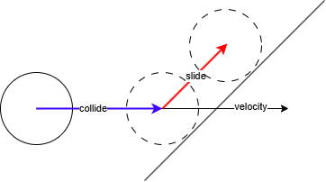
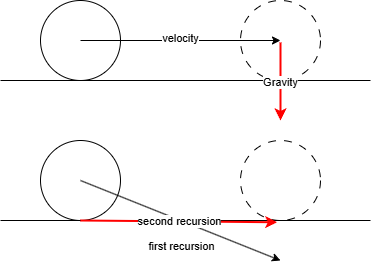

## Part 1: Character controller

In this 2 part blog I will explain the theory and implementation of a basic character controller and add the advanced movement mechanic along side it. Wall running, This will spice up any game by giving the player a lot more freedom to explore your game world.

Part 1: [Character controller](./wall-running-technical-breakdown-part-1.html) \
Part 2: [Wall running](./wall-running-technical-breakdown-part-2.html)

In this first part we talk about the difference between kinematic and dynamic rigid bodies for character controllers. Show you a few examples from different media and show you my approach on the topic.\
At the end of this part you will have a kinematic character controller with a first person camera that sweeps the area in the desired player input direction and handles the collision detection and resolves it. This same system will be easily applicable for gravity as well.

If you are using a game engine like Unity then you can skip this first part and go directly to Part 2: [wall running](./wall-running-technical-breakdown-part-2.html).


### Difference between kinematic and dynamic

Typically in games, character controller are either kinematic or dynamic.

#### Dynamic
The difference is that dynamic character controllers move their characters using forces resolved purely by the physics engine. \
Examples of this are seen in games like:
- Gang Beasts
- Human: Fall Flat
- Boneworks
- Totally Accurate Battle Simulator 

These games often make it their USP (unique selling point) that their game characters are physics driven.
Games like "Gang Beasts" and "Human: Fall Flat" use that slightly unpredictable chaos of using forces to drive the player to create funny interactions with the environment and other players.

#### Kinematic
Kinematic character controllers move their players directly without passing input through the physics engine first. the player directly effects the character. kinematic character controllers aren't moved by forces. physics is sort of faked in these types of games.

Examples of this are seen in games like:
- Call of Duty
- Titanfall
- Grand Theft Auto 5
- Super Mario 64

This is the more common option since this type of character controller is a whole lot more predictable and often more in line of what the player expects how the character should move.

### Basic kinematic charcter controller

#### Setup
Since kinematic rigidbodies phase through walls when colliding since the normal collision resolve of the physics engine don't apply to to kinematic bodies we need to create a fix for this.\
When creating the physics object you will probably give it a "capsule" shape. this is roughly the shape of a human in terms for proportions.

#### Input
Then when you have created your capsule shape and locked the capsule from rotating along the X and Y axis then it is time to handle input.
```c++
// these are keycodes from WINAPI
#define Key_W  0x57
#define Key_A 0x41
#define Key_S  0x53
#define Key_D  0x44

// This is the code you need for an engine where Y is the up axis.
VECTOR3 forward = VECTOR3(cos(cameraYaw), 0.0f, sin(cameraYaw)).normalize();
VECTOR3 right = forward, VECTOR3(0.0f, 1.0f, 0.0f).cross().normalize();

// This is the code you need for an engine where Z is the up axis.
VECTOR3 forward = VECTOR3(cos(cameraYaw), sin(cameraYaw), 0.0f).normalize();
VECTOR3 right = forward, VECTOR3(0.0f, 0.0f, 1.0f).cross().normalize();

// The rest of the code is unaffected related if Y or Z is up
VECTOR3 movementInput(0.0f);
if (GetAsyncKeyState(Key_W))
	movementInput += forward;
if (GetAsyncKeyState(Key_S))
	movementInput -= forward;
if (GetAsyncKeyState(Key_A))
	movementInput -= right;
if (GetAsyncKeyState(Key_D))
	movementInput += right;

// You need to normalize the vector length since if you don't do this,
// the player will move faster diagonal then when only pressing 1 movement key.
if (movementInput.length() > 0.0f)
	movementInput = movementInput.normalize(); 
```
Since we are making an FPS controller when holding W, it should be relative to the camera's direction.
So you need to get the camera yaw to see what direction the player is facing.

#### Collide and Slide algorithm
##### Theory
There are alternatives to "Collide and Slide" but it is by far the most universal and most common method out there.

Collide and slide is an old technique thought to be invented at Id software, likely by John Carmack.
Collide and slide is in a nutshell is:
  1. take collider shape
  2. sweep the collider forward and check for a collision overlap.
  3. move the player as close to target location.
  4. take the remaining length of the movement vector.
  5. project that movement vector along the plane of impact to "redirect it".
  6. apply the newly calculated vector and apply it to the player.

  

This is the bare bones version of the system. You can expand it by applying more steps:

  7. get the dot product of the angle of impact, compared to the normal of the face you collided with.
  8. relative to the dot product decrease the length of the newly calculated movement vector.
  9. check the gravity pass Collide and slide and if the floor check is too steep, slide, if flat enough. toggle player.m_grounded


This should give you a basic understanding on how you should go about implementing this to your own game.
##### Implementation
```c++
VECTOR3 CollideAndSlide(VECTOR3 vel, VECTOR3 pos, int depth, bool gravityPass, VECTOR3 velInit, float modifier)
{
if (depth >= player.m_maxBounces)
{
	return VECTOR3(0);
}

MATRIX4 start = player.transform.GetPosition();

Shape shape = player.GetShape();
MATRIX4 world_transform = bodyInterface.GetWorldTransform(bid);

float scale_factor = 0.95f;
VECTOR3 scaled_scale = player.transform.GetScale() * scale_factor;

ShapeCast shape_cast(
	shape,
	scaled_scale,
	world_transform,
	vel
);

Array<ShapeCastResult> hits;
CollisionCollector<CastShapeCollector> collector;

physicsSystem.GetInternalSystem()->GetNarrowPhaseQuery().CastShape(
	shape_cast,
	settings,
	base_offset,
	collector
);

for (const auto& hit : collector.mHits)
{
  VECTOR3 hit_normal = ToGlm(-hit.mPenetrationAxis.normalize());

  //Related to the normal of the collided plane, count that as a "ground"
	if (gravityPass)
	{
      // This is the code you need for an engine where Y is the up axis.
		if (hit_normal.Y > 0.9f)
		{
			player.m_isGrounded = true;
		}

      // This is the code you need for an engine where Z is the up axis.
		if (hit_normal.z > 0.9f)
		{
			player.m_isGrounded = true;
		}
	}

	VECTOR3 snapToSurface = vel.normalize() * hit.mPenetrationDepth;
 	VECTOR3 leftover = vel - snapToSurface;
  // This is the code you need for an engine where Y is the up axis.
	float angle = VECTOR3(0, 1, 0).normalize().dot(hit_normal).acos().degrees();
  // This is the code you need for an engine where Z is the up axis.
	float angle = VECTOR3(0, 1, 1).normalize().dot(hit_normal).acos().degrees();


// this is for sliding on angled slopes that are steeper than layer.m_maxSlopeAngle
	if (angle <= player.m_maxSlopeAngle)
	{
		if (gravityPass)
		{
			return snapToSurface * modifier;
		}
			leftover = ProjectAndScale(leftover, hit_normal);
	}
	else
	{
    // This is the code you need for an engine where Y is the up axis.
		float dotProduct = 1.0f - 
       VECTOR3( hit_normal.x, 0, hit_normal.z).normalize().dot(
			-VECTOR3( velInit.x, 0, velInit.y).normalize());

    // This is the code you need for an engine where Z is the up axis.
		float dotProduct = 1.0f - 
       VECTOR3(hit_normal.x, hit_normal.y, 0).normalize().dot(
			-VECTOR3(velInit.x, velInit.y, 0).normalize());

    // this remapping is to make the player not "stick" to the wall as much
		float scale = Remap(dotProduct, 0.0f, 0.15f, 0.0f, 1.0f);
		scale = glm::Clamp(scale, 0.0f, 1.0f);

		if (player.m_isGrounded && !gravityPass)
		{
      // This is the code you need for an engine where Y is the up axis.
			leftover = ProjectAndScale(
 				VECTOR3(leftover.x, 0, leftover.z),
				VECTOR3(hit_normal.x, 0, hit_normal.z)).normalize();
      // This is the code you need for an engine where Z is the up axis.
      leftover = ProjectAndScale(
 				VECTOR3(leftover.x, leftover.y, 0),
				VECTOR3(hit_normal.x, hit_normal.y, 0)).normalize();
			leftover *= scale;
		}
		else
		{
			leftover = ProjectAndScale(leftover, hit_normal) * scale;
		}
	}
  // recursive pass if there is still leftover length after the first redirection.
	VECTOR3 speed = snapToSurface * modifier + CollideAndSlide(leftover, pos + snapToSurface, depth + 1, gravityPass, velInit, modifier);
	return speed * modifier;
	}
  // if no collision has taken place. just pass the player speed back as intended.
return vel;
}
```

###### Helper methods
```c++
VECTOR3 ProjectAndScale(VECTOR3 vec, VECTOR3 normal)
{
  float mag = vec.length();

  float dotProduct = normal.dot(vec);
  float magnitudeSquared = normal.dot(normal);
  VECTOR3 projection = (dotProduct / magnitudeSquared) * normal;
  if (vec != projection)
  {
    VECTOR3 projectedVec = vec - projection;
    projectedVec.normalize();
    projectedVec *= mag;
    return projectedVec;
  }
return VECTOR3(0.0001f);
}

float Remap(float value, float start1, float end1, float start2, float end2)
{
  float t = (value - start1) / (end1 - start1);
  return start2 + t * (end2 - start2);
}

float Clamp(float d, float min, float max)
{
  const double t = d < min ? min : d;
  return t > max ? max : t;
}
```

###### How to implement it
```c++
// This is the code you need for an engine where Y is the up axis.
VECTOR3 gravity = VECTOR3(0,-10,0)
// This is the code you need for an engine where Z is the up axis.
VECTOR3 gravity = VECTOR3(0,0,-10)

void Move(float velocity)
{
		velocity += CollideAndSlide(velocity, transform.GetTranslation(), 0, false, velocity, player.speed);
		velocity += CollideAndSlide(gravity, transform.GetTranslation() + velocity, 0, true, gravity, player.density);
}
```

You dont gain any peformance when combining both velocity and gravity in this case due to it taking just as many calculations.



This should get you in a good place to start [Part 2: wall running](./wall-running-technical-breakdown-part-2.html).

Sources:


[Virtual-Key Codes - Windows](https://learn.microsoft.com/en-us/windows/win32/inputdev/virtual-key-codes)\
[Character Controllers - NVIDIA](https://docs.nvidia.com/gameworks/content/gameworkslibrary/physx/guide/Manual/CharacterControllers.html)\
[Moving Characters in Games – Kinematic Character Controller in Unity - Nick Maltbie](https://youtu.be/s-99Z_W8bcQ?si=ylJKyuFEmlmsqH07)\
[Collide And Slide - *Actually Decent* Character Collision From Scratch - Poke Dev](https://youtu.be/YR6Q7dUz2uk?si=HxrokkEFIoWsMxGK)\
[Improving the Numerical Robustness of Sphere Swept Collision Detection - Jeff Linahan](https://arxiv.org/pdf/1211.0059)\
[Improved Collision detection and Response - Kasper Fauerby](http://www.peroxide.dk/papers/collision/collision.pdf)\
[ADVANCED WALL RUNNING - Unity Tutorial (Remastered) - Dave / GameDevelopment](https://youtu.be/gNt9wBOrQO4?si=yqR1M8BOmWqbvtyn)\
[Parkour movement Tutorial In Unity  - Harald](https://youtu.be/XM3MNMmHTxs?si=mX8WsBSkYStbtoAb)\
[Why Is Titanfall 2’s Movement System So Good? - Callum Gibson](https://claritypotion.com/2022/07/11/titanfall-movement-system-so-good/)\
[Designing Unforgettable Titanfall Single Player Levels with Action Blocks - Christopher Dionne](https://www.gdcvault.com/play/1025105/Designing-Unforgettable-Titanfall-Single-Player)\
[How Titanfall 2 Made Movement the Star of the Show - Art of the Level - IGN](https://youtu.be/jajgleIR9tI?si=IzHN2Yixv5PZF8n0)\
[Titanfall 2 how design informs speed - Abhishekiyer](https://medium.com/@abhishekiyer_25378/titanfall-2-how-design-informs-speed-f14998d7f470)